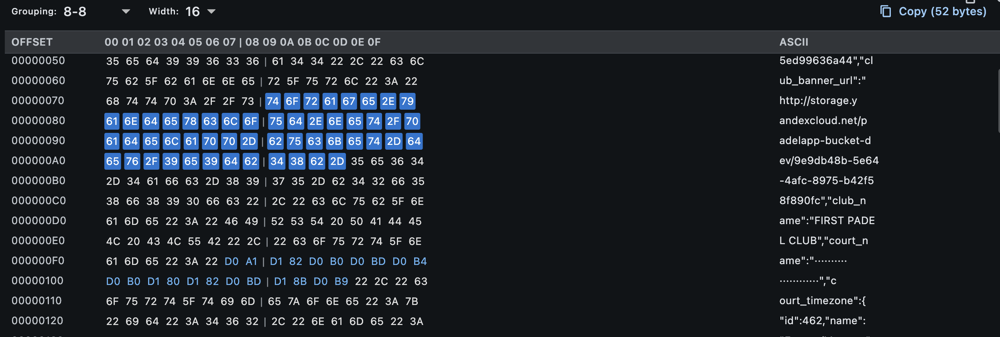

# hex_viewer



Zero-dependency hexadecimal viewer widget for Flutter with advanced features:

✅ **Zero dependencies** - only Flutter SDK
✅ **Virtualized scrolling** - handles files of any size
✅ **Byte selection** - click to select, Shift+click to extend
✅ **Copy support** - hex, text, or binary format
✅ **Configurable grouping** - 4-4-4-4, 8-8, or no grouping
✅ **Color coding** - different colors for null bytes, ASCII, control chars
✅ **Dark/light themes** - automatic theme adaptation
✅ **Keyboard support** - Shift+click for range selection

## Installation

Add this to your `pubspec.yaml`:

```yaml
dependencies:
  hex_viewer: ^0.1.0
```

Then run:

```bash
flutter pub get
```

## Quick Start

```dart
import 'package:hex_viewer/hex_viewer.dart';

// Simple usage
HexViewer(
  data: myBinaryData, // List<int>
)

// With configuration
HexViewer(
  data: myBinaryData,
  config: HexConfig(
    bytesPerLine: 16,
    groupSize: 8,
    colorScheme: ByteColorScheme.fromTheme(Theme.of(context)),
  ),
  onSelectionChanged: (selection) {
    print('Selected: ${selection?.length} bytes');
  },
)
```

## Features

### Byte Selection
- Click a byte to select it
- Shift+click to extend selection
- Selection info displayed in status bar

### Copy to Clipboard
- **Hex format**: `48 65 6C 6C 6F`
- **Text format**: `Hello` (with `·` for non-printable)
- **Binary format**: Raw bytes as string

### Byte Grouping
- **None**: `48 65 6C 6C 6F 20 57 6F 72 6C 64`
- **4-4-4-4**: `48656C6C | 6F20576F | 726C64`
- **8-8**: `48 65 6C 6C 6F 20 57 6F | 72 6C 64`

### Color Coding
- Null bytes (0x00): Gray
- Printable ASCII (0x20-0x7E): Normal color
- Control chars (0x01-0x1F): Red
- Extended ASCII (0x80+): Blue

## API

### HexViewer

| Parameter             | Type                            | Description                       |
| --------------------- | ------------------------------- | --------------------------------- |
| `data`                | `List<int>`                     | Binary data to display (required) |
| `config`              | `HexConfig`                     | Display configuration             |
| `onSelectionChanged`  | `ValueChanged<ByteSelection?>?` | Selection callback                |
| `monospaceFontFamily` | `String?`                       | Custom monospace font             |

### HexConfig

| Parameter         | Type              | Default    | Description                  |
| ----------------- | ----------------- | ---------- | ---------------------------- |
| `bytesPerLine`    | `int`             | `16`       | Bytes per row (8, 16, or 32) |
| `groupSize`       | `int`             | `8`        | Group separator (0, 4, or 8) |
| `showOffset`      | `bool`            | `true`     | Show offset column           |
| `showAscii`       | `bool`            | `true`     | Show ASCII column            |
| `enableSelection` | `bool`            | `true`     | Enable byte selection        |
| `enableCopy`      | `bool`            | `true`     | Enable copy to clipboard     |
| `colorScheme`     | `ByteColorScheme` | `standard` | Color scheme                 |

## Example Output

```
| OFFSET   | 00 01 02 03 04 05 06 07 | 08 09 0A 0B 0C 0D 0E 0F | ASCII            |
| -------- | ----------------------- | ----------------------- | ---------------- |
| 00000000 | 48 65 6C 6C 6F 20 57 6F | 72 6C 64 21 0A 00 00 00 | Hello World!···· |
| 00000010 | 54 68 69 73 20 69 73 20 | 62 69 6E 61 72 79 00 00 | This is binary·· |
```

## License

See [LICENSE](LICENSE) file.
