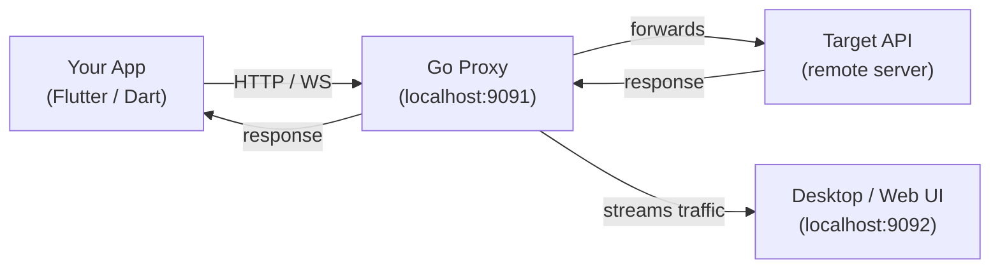

## Packages

| Package | What it does |
|---|---|
| [`network_debugger`](https://pub.dev/packages/network_debugger) | CLI launcher — starts the proxy and opens the UI |
| [`dio_debugger`](https://pub.dev/packages/dio_debugger) | Attaches the proxy to a Dio HTTP client |
| [`http_debugger`](https://pub.dev/packages/http_debugger) | Global HTTP interception via `HttpOverrides` |
| [`web_socket_debugger`](https://pub.dev/packages/web_socket_debugger) | Intercepts `dart:io` WebSocket connections |
| [`web_socket_channel_debugger`](https://pub.dev/packages/web_socket_channel_debugger) | Intercepts `package:web_socket_channel` |
| [`socket_io_debugger`](https://pub.dev/packages/socket_io_debugger) | Captures Socket.IO events and payloads |
| [`firebase_database_debugger`](https://pub.dev/packages/firebase_database_debugger) | Tracks Firebase Realtime Database operations |
| [`hex_viewer`](https://pub.dev/packages/hex_viewer) | Flutter widget for viewing binary data in HEX |

## Quick Setup

::: code-group
```bash [Install]
dart pub global activate network_debugger
network_debugger
```
```dart [Dio]
import 'package:dio_debugger/dio_debugger.dart';

final dio = Dio()..interceptors.add(DioDebugger());
```
```dart [HttpOverrides]
import 'package:http_debugger/http_debugger.dart';

HttpOverrides.global = DebuggerHttpOverrides();
```
:::

## Architecture



Your app sends traffic through a local Go proxy. The proxy records everything and forwards it to the real server. The UI connects to the proxy and displays traffic in real time.
