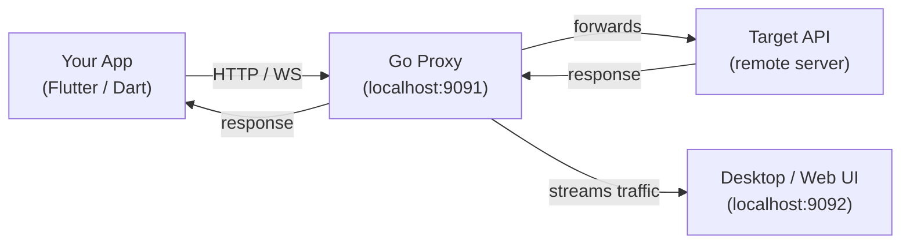

## Quick Setup

<script setup>
import { ref } from 'vue'
const tab = ref('install')
</script>

<div class="setup-tabs">
<div class="setup-tabs-nav">
<button v-for="t in [
  {id:'install',label:'Install'},
  {id:'dio',label:'Dio'},
  {id:'http',label:'HttpOverrides'},
  {id:'ws',label:'WebSocket'},
  {id:'wsc',label:'WebSocketChannel'},
  {id:'sio',label:'Socket.IO'},
  {id:'firebase',label:'Firebase RTDB'},
]" :key="t.id" :class="['setup-tab-btn', {active: tab === t.id}]" @click="tab = t.id">{{ t.label }}</button>
</div>
</div>

<div v-show="tab === 'install'">

```bash
dart pub global activate network_debugger
network_debugger
```

<a class="setup-guide-link" href="/guide/network_debugger_workspace/quick-start">📚 Quick Start Guide →</a>

</div>
<div v-show="tab === 'dio'">

```dart
import 'package:dio_debugger/dio_debugger.dart';

final dio = Dio()..interceptors.add(DioDebugger());
```

<a class="setup-guide-link" href="/guide/network_debugger_workspace/packages/dio_debugger">📚 Dio Debugger documentation →</a>

</div>
<div v-show="tab === 'http'">

```dart
import 'package:http_debugger/http_debugger.dart';

HttpOverrides.global = DebuggerHttpOverrides();
```

<a class="setup-guide-link" href="/guide/network_debugger_workspace/packages/http_debugger">📚 HTTP Debugger documentation →</a>

</div>
<div v-show="tab === 'ws'">

```dart
import 'package:web_socket_debugger/web_socket_debugger.dart';

final cfg = WebSocketDebugger.attach(baseUrl: 'wss://echo.websocket.events');
final socket = await WebSocketDebugger.connect(config: cfg);
```

<a class="setup-guide-link" href="/guide/network_debugger_workspace/packages/web_socket_debugger">📚 WebSocket Debugger documentation →</a>

</div>
<div v-show="tab === 'wsc'">

```dart
import 'package:web_socket_channel_debugger/web_socket_channel_debugger.dart';

final cfg = WebSocketChannelDebugger.attach(baseUrl: 'wss://echo.websocket.events');
final channel = WebSocketChannelDebugger.connect(config: cfg);
```

<a class="setup-guide-link" href="/guide/network_debugger_workspace/packages/web_socket_channel_debugger">📚 WebSocketChannel Debugger documentation →</a>

</div>
<div v-show="tab === 'sio'">

```dart
import 'package:socket_io_client/socket_io_client.dart' as io;
import 'package:socket_io_debugger/socket_io_debugger.dart';

final cfg = SocketIoDebugger.attach(baseUrl: 'https://example.com');
final socket = io.io(cfg.effectiveBaseUrl,
  io.OptionBuilder()
    .setPath(cfg.effectivePath)
    .setQuery(cfg.query)
    .build());
```

<a class="setup-guide-link" href="/guide/network_debugger_workspace/packages/socket_io_debugger">📚 Socket.IO Debugger documentation →</a>

</div>
<div v-show="tab === 'firebase'">

```dart
import 'package:firebase_database_debugger/firebase_database_debugger.dart';

final debugger = FirebaseDatabaseDebugger();
final ref = debugger.ref(FirebaseDatabase.instance.ref('users'));
```

<a class="setup-guide-link" href="/guide/firebase-database">📚 Firebase RTDB Debugger documentation →</a>

</div>

<style>
.setup-tabs { margin-top: 16px; }
.setup-tabs-nav {
  display: flex;
  flex-wrap: wrap;
  gap: 0;
  border-bottom: 1px solid var(--vp-c-divider);
  padding: 0 4px;
}
.setup-tab-btn {
  padding: 8px 16px;
  border: none;
  background: none;
  color: var(--vp-c-text-2);
  cursor: pointer;
  font-size: 14px;
  font-weight: 500;
  border-bottom: 2px solid transparent;
  transition: color 0.2s, border-color 0.2s;
}
.setup-tab-btn:hover { color: var(--vp-c-text-1); }
.setup-tab-btn.active {
  color: var(--vp-c-brand-1);
  border-bottom-color: var(--vp-c-brand-1);
}
.setup-guide-link {
  display: inline-block;
  margin-top: -8px;
  margin-bottom: 8px;
  padding: 6px 14px;
  background: var(--vp-c-bg-soft);
  border: 1px solid var(--vp-c-divider);
  border-radius: 6px;
  color: var(--vp-c-brand-1);
  font-size: 14px;
  font-weight: 500;
  text-decoration: none;
  transition: background 0.2s, border-color 0.2s;
}
.setup-guide-link:hover {
  background: var(--vp-c-bg-elv);
  border-color: var(--vp-c-brand-1);
}
</style>

## Architecture



Your app sends traffic through a local Go proxy. The proxy records everything and forwards it to the real server. The UI connects to the proxy and displays traffic in real time.

## Packages

| Package | What it does |
|---|---|
| [`network_debugger`](https://pub.dev/packages/network_debugger) | CLI launcher — starts the proxy and opens the UI |
| [`dio_debugger`](https://pub.dev/packages/dio_debugger) | Attaches the proxy to a Dio HTTP client |
| [`http_debugger`](https://pub.dev/packages/http_debugger) | Global HTTP interception via `HttpOverrides` |
| [`web_socket_debugger`](https://pub.dev/packages/web_socket_debugger) | Intercepts `dart:io` WebSocket connections |
| [`web_socket_channel_debugger`](https://pub.dev/packages/web_socket_channel_debugger) | Intercepts `package:web_socket_channel` |
| [`socket_io_debugger`](https://pub.dev/packages/socket_io_debugger) | Captures Socket.IO events and payloads |
| [`firebase_database_debugger`](https://pub.dev/packages/firebase_database_debugger) | Tracks Firebase Realtime Database operations |
| [`hex_viewer`](https://pub.dev/packages/hex_viewer) | Flutter widget for viewing binary data in HEX |
