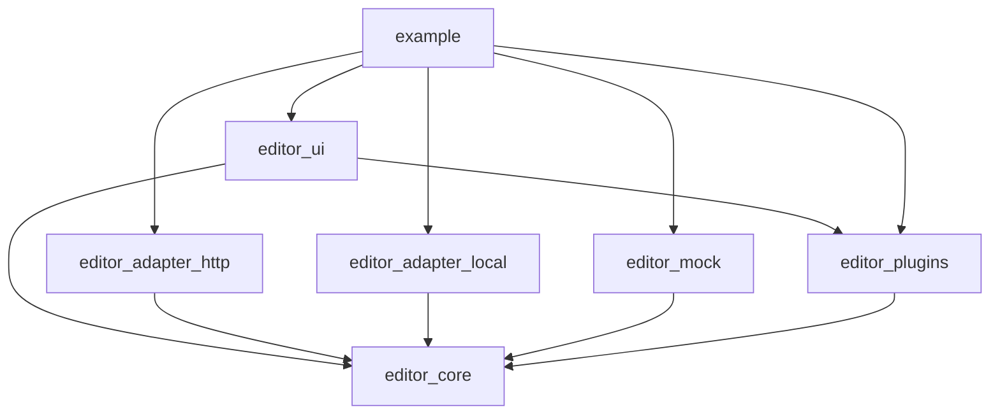

# Multi-File Code Editor Package - Technical Specification

**Version:** 1.0
**Date:** 2025-01-05
**Status:** Planning Phase
**Architecture:** Clean Architecture + DDD + Hexagonal + Plugin System

---

## Table of Contents

1. [Executive Summary](#executive-summary)
2. [Project Structure](#project-structure)
3. [Architecture Overview](#architecture-overview)
4. [Core Domain (editor_core)](#core-domain-editor_core)
5. [UI Layer (editor_ui)](#ui-layer-editor_ui)
6. [Plugin System (editor_plugins)](#plugin-system-editor_plugins)
7. [Adapters](#adapters)
8. [Implementation Roadmap](#implementation-roadmap)
9. [API Documentation](#api-documentation)
10. [Testing Strategy](#testing-strategy)
11. [Migration & Integration](#migration--integration)
12. [Publishing Strategy](#publishing-strategy)

---

## 1. Executive Summary

### 1.1 Project Goals

Create a **production-ready, extensible, multi-file code editor** package for Flutter that:

- ✅ Supports unlimited folder nesting with hierarchical file tree
- ✅ Integrates Monaco Editor via `flutter_monaco` package
- ✅ Provides drag & drop file operations (move, copy)
- ✅ Implements plugin architecture for extensibility
- ✅ Offers multiple backend adapters (HTTP, Local, Custom)
- ✅ Follows Clean Architecture, DDD, SOLID, DRY principles
- ✅ Ready for pub.dev publication
- ✅ Framework-agnostic core (works with any Flutter app)

### 1.2 Key Architectural Decisions

| Decision | Rationale |
|----------|-----------|
| **Hexagonal Architecture** | Clear separation between domain, application, and infrastructure |
| **Plugin System** | Extensibility without modifying core code |
| **ValueNotifier State Management** | Zero external dependencies, Flutter-native |
| **Monorepo Structure** | Independent packages with shared development workflow |
| **Port & Adapter Pattern** | Easy backend swapping (HTTP, Local, Mock) |
| **Freezed for Domain Models** | Immutability, type safety, code generation |

### 1.3 Timeline

- **Phase 1 (Week 1-2):** Core domain + Plugin system foundation
- **Phase 2 (Week 3-4):** UI layer with Monaco + File tree
- **Phase 3 (Week 5):** HTTP adapter + Sync coordinator
- **Phase 4 (Week 6):** Local storage adapter + Offline-first
- **Phase 5 (Week 7-8):** Polish, documentation, examples

**Total:** 7-8 weeks for v1.0 release

---

## 2. Project Structure

### 2.1 Directory Layout

```
multi_file_code_editor/                      # ← SEPARATE PROJECT ROOT
├── README.md                                 # Main documentation
├── LICENSE                                   # BSD-3-Clause
├── CHANGELOG.md                              # Version history
├── pubspec.yaml                              # Workspace config (for melos)
├── melos.yaml                                # Monorepo orchestration
├── analysis_options.yaml                     # Shared lint rules
│
├── modules/                                  # ← MONOREPO MODULES
│   │
│   ├── editor_core/                          # 📦 Core Domain Layer
│   │   ├── README.md
│   │   ├── pubspec.yaml
│   │   ├── lib/
│   │   │   ├── editor_core.dart              # Public API
│   │   │   └── src/
│   │   │       ├── domain/
│   │   │       │   ├── entities/
│   │   │       │   │   ├── file_document.dart
│   │   │       │   │   ├── folder.dart
│   │   │       │   │   ├── project.dart
│   │   │       │   │   └── file_tree_node.dart
│   │   │       │   ├── value_objects/
│   │   │       │   │   ├── file_name.dart
│   │   │       │   │   ├── file_path.dart
│   │   │       │   │   ├── file_content.dart
│   │   │       │   │   └── language_id.dart
│   │   │       │   └── failures/
│   │   │       │       ├── domain_failure.dart
│   │   │       │       ├── validation_failure.dart
│   │   │       │       └── sync_failure.dart
│   │   │       └── ports/                    # Interfaces only
│   │   │           ├── repositories/
│   │   │           │   ├── file_repository.dart
│   │   │           │   ├── folder_repository.dart
│   │   │           │   └── project_repository.dart
│   │   │           ├── services/
│   │   │           │   ├── sync_service.dart
│   │   │           │   ├── validation_service.dart
│   │   │           │   └── language_detector.dart
│   │   │           └── events/
│   │   │               ├── editor_event.dart
│   │   │               └── event_bus.dart
│   │   └── test/
│   │       ├── domain/
│   │       └── ports/
│   │
│   ├── editor_plugins/                       # 🔌 Plugin System
│   │   ├── README.md
│   │   ├── pubspec.yaml
│   │   ├── lib/
│   │   │   ├── editor_plugins.dart
│   │   │   └── src/
│   │   │       ├── plugin_api/
│   │   │       │   ├── plugin_interface.dart
│   │   │       │   ├── plugin_context.dart
│   │   │       │   ├── plugin_manifest.dart
│   │   │       │   └── plugin_lifecycle.dart
│   │   │       ├── plugin_manager/
│   │   │       │   ├── plugin_loader.dart
│   │   │       │   ├── plugin_registry.dart
│   │   │       │   └── plugin_resolver.dart
│   │   │       ├── builtin_plugins/
│   │   │       │   ├── syntax_highlighter_plugin.dart
│   │   │       │   ├── autocomplete_plugin.dart
│   │   │       │   ├── linter_plugin.dart
│   │   │       │   └── formatter_plugin.dart
│   │   │       └── hooks/
│   │   │           ├── editor_hook.dart
│   │   │           ├── file_hook.dart
│   │   │           └── ui_hook.dart
│   │   └── test/
│   │
│   ├── editor_ui/                            # 🎨 UI Layer
│   │   ├── README.md
│   │   ├── pubspec.yaml
│   │   ├── lib/
│   │   │   ├── editor_ui.dart
│   │   │   └── src/
│   │   │       ├── controllers/
│   │   │       │   ├── editor_controller.dart
│   │   │       │   ├── file_tree_controller.dart
│   │   │       │   ├── project_controller.dart
│   │   │       │   └── plugin_ui_controller.dart
│   │   │       ├── state/
│   │   │       │   ├── editor_state.dart
│   │   │       │   ├── file_tree_state.dart
│   │   │       │   └── ui_state.dart
│   │   │       ├── widgets/
│   │   │       │   ├── code_editor/
│   │   │       │   │   ├── monaco_code_editor.dart
│   │   │       │   │   ├── editor_config.dart
│   │   │       │   │   ├── editor_theme.dart
│   │   │       │   │   └── editor_toolbar.dart
│   │   │       │   ├── file_tree/
│   │   │       │   │   ├── file_tree_view.dart
│   │   │       │   │   ├── tree_node_widget.dart
│   │   │       │   │   ├── file_item.dart
│   │   │       │   │   ├── folder_item.dart
│   │   │       │   │   └── tree_operations.dart
│   │   │       │   ├── drag_drop/
│   │   │       │   │   ├── draggable_file.dart
│   │   │       │   │   ├── drop_target.dart
│   │   │       │   │   └── drag_feedback.dart
│   │   │       │   ├── dialogs/
│   │   │       │   │   ├── create_file_dialog.dart
│   │   │       │   │   ├── create_folder_dialog.dart
│   │   │       │   │   ├── rename_dialog.dart
│   │   │       │   │   └── import_dialog.dart
│   │   │       │   └── editor_scaffold.dart
│   │   │       └── utils/
│   │   │           ├── file_type_detector.dart
│   │   │           ├── icon_provider.dart
│   │   │           └── color_provider.dart
│   │   └── test/
│   │
│   ├── editor_adapter_http/                  # 🌐 HTTP Backend Adapter
│   │   ├── README.md
│   │   ├── pubspec.yaml
│   │   ├── lib/
│   │   │   ├── editor_adapter_http.dart
│   │   │   └── src/
│   │   │       ├── repositories/
│   │   │       │   ├── http_file_repository.dart
│   │   │       │   ├── http_folder_repository.dart
│   │   │       │   └── http_project_repository.dart
│   │   │       ├── services/
│   │   │       │   ├── http_sync_service.dart
│   │   │       │   └── operation_queue.dart
│   │   │       ├── models/                   # DTOs
│   │   │       │   ├── file_dto.dart
│   │   │       │   ├── folder_dto.dart
│   │   │       │   └── sync_operation_dto.dart
│   │   │       └── config/
│   │   │           ├── http_config.dart
│   │   │           └── api_endpoints.dart
│   │   └── test/
│   │
│   ├── editor_adapter_local/                 # 💾 Local Storage Adapter
│   │   ├── README.md
│   │   ├── pubspec.yaml
│   │   ├── lib/
│   │   │   ├── editor_adapter_local.dart
│   │   │   └── src/
│   │   │       ├── repositories/
│   │   │       │   ├── local_file_repository.dart
│   │   │       │   ├── local_folder_repository.dart
│   │   │       │   └── local_project_repository.dart
│   │   │       ├── services/
│   │   │       │   ├── local_sync_service.dart
│   │   │       │   └── offline_queue.dart
│   │   │       ├── storage/
│   │   │       │   ├── storage_adapter.dart
│   │   │       │   ├── file_storage.dart
│   │   │       │   └── indexed_db_storage_web.dart
│   │   │       └── config/
│   │   │           └── storage_config.dart
│   │   └── test/
│   │
│   └── editor_mock/                          # 🧪 Mock Implementation
│       ├── README.md
│       ├── pubspec.yaml
│       ├── lib/
│       │   ├── editor_mock.dart
│       │   └── src/
│       │       ├── mock_file_repository.dart
│       │       ├── mock_folder_repository.dart
│       │       ├── mock_project_repository.dart
│       │       └── in_memory_storage.dart
│       └── test/
│
├── example/                                  # 📱 Example App
│   ├── pubspec.yaml
│   ├── lib/
│   │   ├── main.dart
│   │   ├── examples/
│   │   │   ├── standalone_example.dart
│   │   │   ├── http_backend_example.dart
│   │   │   ├── offline_first_example.dart
│   │   │   └── plugin_example.dart
│   │   └── mock_backend/
│   │       └── fake_api_server.dart
│   ├── web/
│   ├── macos/
│   ├── windows/
│   └── linux/
│
├── docs/                                     # 📚 Documentation
│   ├── architecture/
│   │   ├── overview.md
│   │   ├── plugin_system.md
│   │   └── state_management.md
│   ├── guides/
│   │   ├── getting_started.md
│   │   ├── custom_adapter.md
│   │   ├── plugin_development.md
│   │   └── theming.md
│   └── api/                                  # Generated API docs
│
└── tool/                                     # 🔧 Development Tools
    ├── generate.sh
    ├── test_all.sh
    ├── publish.sh
    └── melos_bootstrap.sh
```

### 2.2 Package Dependencies



---

## 3. Architecture Overview

### 3.1 Hexagonal Architecture (Ports & Adapters)

```
┌─────────────────────────────────────────────────────────────┐
│                         UI Layer                            │
│  ┌──────────────────────────────────────────────────────┐   │
│  │  Widgets, Controllers, State Management              │   │
│  └────────────────────┬─────────────────────────────────┘   │
│                       │                                      │
│                       ▼                                      │
│  ┌──────────────────────────────────────────────────────┐   │
│  │              Application Layer                        │   │
│  │  ┌────────────────────────────────────────────────┐  │   │
│  │  │  Use Cases, Business Logic                     │  │   │
│  │  └────────────────────────────────────────────────┘  │   │
│  └────────────────────┬─────────────────────────────────┘   │
└───────────────────────┼─────────────────────────────────────┘
                        │
┌───────────────────────┼─────────────────────────────────────┐
│                       │    Domain Core (Hexagon)            │
│                       ▼                                      │
│  ┌─────────────────────────────────────────────────────┐    │
│  │                Entities                              │    │
│  │  FileDocument, Folder, Project, FileTreeNode        │    │
│  └─────────────────────────────────────────────────────┘    │
│  ┌─────────────────────────────────────────────────────┐    │
│  │            Value Objects                             │    │
│  │  FileName, FilePath, FileContent, LanguageId         │    │
│  └─────────────────────────────────────────────────────┘    │
│  ┌─────────────────────────────────────────────────────┐    │
│  │          Ports (Interfaces)                          │    │
│  │  FileRepository, FolderRepository, SyncService       │    │
│  └─────────────────────────────────────────────────────┘    │
└──────────────┬────────────────────────┬────────────────────┘
               │                        │
      ┌────────▼────────┐      ┌────────▼────────┐
      │  HTTP Adapter   │      │  Local Adapter  │
      │  (Infrastructure│      │  (Infrastructure│
      │   Layer)        │      │   Layer)        │
      └─────────────────┘      └─────────────────┘
```

### 3.2 Plugin Architecture

Based on `flutter-editor-architecture.md`, we implement a **Hook-based Plugin System**:

```dart
// Plugin Interface
abstract class EditorPlugin {
  PluginManifest get manifest;

  Future<void> initialize(PluginContext context);
  Future<void> dispose();

  // Lifecycle hooks
  void onFileOpen(FileDocument file) {}
  void onFileSave(FileDocument file) {}
  void onFileClose(FileDocument file) {}

  // Editor hooks
  void onContentChange(String fileId, String newContent) {}
  void onCursorMove(String fileId, int offset) {}
  void onSelection(String fileId, int start, int end) {}

  // UI hooks
  Widget? buildToolbarAction(BuildContext context) => null;
  Widget? buildContextMenuItem(BuildContext context, FileDocument file) => null;
  Widget? buildSidePanelWidget(BuildContext context) => null;
}

// Plugin Manifest
class PluginManifest {
  final String id;
  final String name;
  final String version;
  final String description;
  final List<String> dependencies;
  final Map<String, dynamic> config;

  const PluginManifest({...});
}

// Plugin Context (provides access to editor APIs)
class PluginContext {
  final FileRepository fileRepository;
  final FolderRepository folderRepository;
  final EventBus eventBus;
  final PluginRegistry registry;

  // API methods for plugins
  Future<void> showNotification(String message);
  Future<void> registerCommand(String id, CommandHandler handler);
  Future<void> contributeMenuItem(MenuItem item);
}
```

**Built-in Plugins:**
1. **SyntaxHighlighterPlugin** - Language-specific highlighting
2. **AutocompletePlugin** - Context-aware code completion
3. **LinterPlugin** - Real-time error detection
4. **FormatterPlugin** - Code formatting
5. **GitIntegrationPlugin** - Version control (optional)

### 3.3 SOLID Principles Application

| Principle | Implementation |
|-----------|----------------|
| **Single Responsibility** | Each class has one reason to change (e.g., `FileRepository` only handles file persistence) |
| **Open/Closed** | Plugin system allows extension without modifying core code |
| **Liskov Substitution** | All adapters implement same ports and are interchangeable |
| **Interface Segregation** | Small, focused interfaces (FileRepository, FolderRepository separated) |
| **Dependency Inversion** | UI depends on abstractions (ports), not concrete implementations |

### 3.4 DDD Bounded Contexts

```
┌─────────────────────────────────────────────────────────┐
│              Editor Bounded Context                     │
│  ┌────────────────┐  ┌────────────────┐                │
│  │  File Domain   │  │ Folder Domain  │                │
│  └────────────────┘  └────────────────┘                │
│  ┌────────────────────────────────────┐                │
│  │       Project Domain               │                │
│  └────────────────────────────────────┘                │
└─────────────────────────────────────────────────────────┘

┌─────────────────────────────────────────────────────────┐
│            Plugin Bounded Context                       │
│  ┌────────────────────────────────────┐                │
│  │   Plugin Management Domain         │                │
│  └────────────────────────────────────┘                │
└─────────────────────────────────────────────────────────┘

┌─────────────────────────────────────────────────────────┐
│           Sync Bounded Context                          │
│  ┌────────────────────────────────────┐                │
│  │  Synchronization Domain            │                │
│  └────────────────────────────────────┘                │
└─────────────────────────────────────────────────────────┘
```

---

## 4. Core Domain (editor_core)

### 4.1 Domain Entities

#### 4.1.1 FileDocument

```dart
// lib/src/domain/entities/file_document.dart
import 'package:freezed_annotation/freezed_annotation.dart';

part 'file_document.freezed.dart';
part 'file_document.g.dart';

@freezed
class FileDocument with _$FileDocument {
  const FileDocument._();

  const factory FileDocument({
    required String id,
    required String name,
    required String folderId,
    required String content,
    required String language,
    required DateTime createdAt,
    required DateTime updatedAt,
    Map<String, dynamic>? metadata,
  }) = _FileDocument;

  factory FileDocument.fromJson(Map<String, dynamic> json) =>
      _$FileDocumentFromJson(json);

  // Domain methods
  FileDocument updateContent(String newContent) {
    return copyWith(
      content: newContent,
      updatedAt: DateTime.now(),
    );
  }

  bool get isEmpty => content.trim().isEmpty;

  int get lineCount => content.split('\n').length;

  String get extension {
    final parts = name.split('.');
    return parts.length > 1 ? parts.last : '';
  }
}
```

#### 4.1.2 Folder

```dart
// lib/src/domain/entities/folder.dart
@freezed
class Folder with _$Folder {
  const Folder._();

  const factory Folder({
    required String id,
    required String name,
    String? parentId,
    @Default([]) List<String> childFolderIds,
    @Default([]) List<String> fileIds,
    required DateTime createdAt,
    required DateTime updatedAt,
    Map<String, dynamic>? metadata,
  }) = _Folder;

  factory Folder.fromJson(Map<String, dynamic> json) =>
      _$FolderFromJson(json);

  // Domain methods
  bool get isRoot => parentId == null;

  bool get isEmpty => childFolderIds.isEmpty && fileIds.isEmpty;

  int get totalItems => childFolderIds.length + fileIds.length;

  Folder addFile(String fileId) {
    return copyWith(
      fileIds: [...fileIds, fileId],
      updatedAt: DateTime.now(),
    );
  }

  Folder removeFile(String fileId) {
    return copyWith(
      fileIds: fileIds.where((id) => id != fileId).toList(),
      updatedAt: DateTime.now(),
    );
  }

  Folder addFolder(String folderId) {
    return copyWith(
      childFolderIds: [...childFolderIds, folderId],
      updatedAt: DateTime.now(),
    );
  }

  Folder removeFolder(String folderId) {
    return copyWith(
      childFolderIds: childFolderIds.where((id) => id != folderId).toList(),
      updatedAt: DateTime.now(),
    );
  }
}
```

#### 4.1.3 Project

```dart
// lib/src/domain/entities/project.dart
@freezed
class Project with _$Project {
  const Project._();

  const factory Project({
    required String id,
    required String name,
    required String rootFolderId,
    Map<String, dynamic>? config,
    required DateTime createdAt,
    required DateTime updatedAt,
  }) = _Project;

  factory Project.fromJson(Map<String, dynamic> json) =>
      _$ProjectFromJson(json);

  // Domain methods
  T? getConfig<T>(String key, {T? defaultValue}) {
    return config?[key] as T? ?? defaultValue;
  }

  Project updateConfig(String key, dynamic value) {
    return copyWith(
      config: {...?config, key: value},
      updatedAt: DateTime.now(),
    );
  }
}
```

#### 4.1.4 FileTreeNode

```dart
// lib/src/domain/entities/file_tree_node.dart
@freezed
class FileTreeNode with _$FileTreeNode {
  const FileTreeNode._();

  const factory FileTreeNode.folder({
    required Folder folder,
    @Default([]) List<FileTreeNode> children,
    @Default(false) bool isExpanded,
  }) = FolderTreeNode;

  const factory FileTreeNode.file({
    required FileDocument file,
  }) = FileNode;

  factory FileTreeNode.fromJson(Map<String, dynamic> json) =>
      _$FileTreeNodeFromJson(json);

  // Domain methods
  bool get isFolder => this is FolderTreeNode;
  bool get isFile => this is FileNode;

  String get id => map(
    folder: (node) => node.folder.id,
    file: (node) => node.file.id,
  );

  String get name => map(
    folder: (node) => node.folder.name,
    file: (node) => node.file.name,
  );
}
```

### 4.2 Value Objects

Value objects enforce domain rules and validation.

```dart
// lib/src/domain/value_objects/file_name.dart
@freezed
class FileName with _$FileName {
  const FileName._();

  const factory FileName(String value) = _FileName;

  factory FileName.fromString(String name) {
    _validate(name);
    return FileName(name);
  }

  static void _validate(String name) {
    if (name.isEmpty) {
      throw ValidationFailure('File name cannot be empty');
    }

    if (name.length > 255) {
      throw ValidationFailure('File name too long (max 255 characters)');
    }

    final invalidChars = RegExp(r'[<>:"/\\|?*]');
    if (invalidChars.hasMatch(name)) {
      throw ValidationFailure('File name contains invalid characters');
    }
  }

  String get extension {
    final parts = value.split('.');
    return parts.length > 1 ? parts.last : '';
  }

  String get nameWithoutExtension {
    final parts = value.split('.');
    if (parts.length > 1) {
      return parts.sublist(0, parts.length - 1).join('.');
    }
    return value;
  }
}

// lib/src/domain/value_objects/file_path.dart
@freezed
class FilePath with _$FilePath {
  const FilePath._();

  const factory FilePath(String value) = _FilePath;

  factory FilePath.fromString(String path) {
    _validate(path);
    return FilePath(path);
  }

  static void _validate(String path) {
    if (path.contains('..')) {
      throw ValidationFailure('Path cannot contain ".."');
    }

    if (path.startsWith('/') || path.startsWith('\\')) {
      throw ValidationFailure('Path must be relative');
    }
  }

  List<String> get segments => value.split('/');

  String get fileName => segments.last;

  String? get parentPath {
    if (segments.length <= 1) return null;
    return segments.sublist(0, segments.length - 1).join('/');
  }
}

// lib/src/domain/value_objects/language_id.dart
@freezed
class LanguageId with _$LanguageId {
  const LanguageId._();

  const factory LanguageId(String value) = _LanguageId;

  factory LanguageId.fromExtension(String extension) {
    final detected = _detectLanguage(extension.toLowerCase());
    return LanguageId(detected);
  }

  static String _detectLanguage(String ext) {
    return switch (ext) {
      'dart' => 'dart',
      'js' => 'javascript',
      'ts' => 'typescript',
      'jsx' => 'javascriptreact',
      'tsx' => 'typescriptreact',
      'py' => 'python',
      'rs' => 'rust',
      'go' => 'go',
      'java' => 'java',
      'kt' || 'kts' => 'kotlin',
      'swift' => 'swift',
      'cpp' || 'cc' || 'cxx' => 'cpp',
      'c' => 'c',
      'cs' => 'csharp',
      'rb' => 'ruby',
      'php' => 'php',
      'html' || 'htm' => 'html',
      'css' => 'css',
      'scss' => 'scss',
      'less' => 'less',
      'json' => 'json',
      'xml' => 'xml',
      'yaml' || 'yml' => 'yaml',
      'toml' => 'toml',
      'md' || 'markdown' => 'markdown',
      'sh' || 'bash' => 'shell',
      'sql' => 'sql',
      _ => 'plaintext',
    };
  }
}
```

### 4.3 Ports (Interfaces)

#### 4.3.1 FileRepository

```dart
// lib/src/ports/repositories/file_repository.dart
abstract class FileRepository {
  /// Create a new file in the specified folder
  Future<FileDocument> create({
    required String folderId,
    required String name,
    String? initialContent,
    String? language,
    Map<String, dynamic>? metadata,
  });

  /// Load file by ID
  Future<FileDocument> load(String id);

  /// Save file (atomic operation)
  Future<void> save(FileDocument file);

  /// Delete file
  Future<void> delete(String id);

  /// Rename file
  Future<FileDocument> rename(String id, String newName);

  /// Move file to different folder
  Future<FileDocument> move(String fileId, String targetFolderId);

  /// Copy file to different folder
  Future<FileDocument> copy(String fileId, String targetFolderId, {String? newName});

  /// Watch file for real-time updates
  Stream<FileDocument> watch(String id);

  /// List all files in a folder
  Future<List<FileDocument>> listInFolder(String folderId);

  /// Search files by name pattern
  Future<List<FileDocument>> search(String pattern);
}
```

#### 4.3.2 FolderRepository

```dart
// lib/src/ports/repositories/folder_repository.dart
abstract class FolderRepository {
  /// Create a new folder
  Future<Folder> create({
    required String name,
    String? parentId,
    Map<String, dynamic>? metadata,
  });

  /// Get folder by ID
  Future<Folder> get(String id);

  /// Rename folder
  Future<Folder> rename(String id, String newName);

  /// Move folder to different parent
  Future<Folder> move(String folderId, String? newParentId);

  /// Delete folder (recursive if specified)
  Future<void> delete(String id, {bool recursive = false});

  /// Get root folder
  Future<Folder> getRoot();

  /// Get all child folders
  Future<List<Folder>> getChildren(String parentId);

  /// Watch folder tree for changes
  Stream<List<Folder>> watchTree({String? rootId});

  /// Build complete file tree
  Future<FileTreeNode> buildTree({String? rootId});
}
```

#### 4.3.3 ProjectRepository

```dart
// lib/src/ports/repositories/project_repository.dart
abstract class ProjectRepository {
  /// Create a new project
  Future<Project> create({
    required String name,
    Map<String, dynamic>? config,
  });

  /// Load project by ID
  Future<Project> load(String id);

  /// Save project configuration
  Future<void> save(Project project);

  /// Delete project (including all files and folders)
  Future<void> delete(String id);

  /// List all projects
  Future<List<Project>> listAll();

  /// Import project from ZIP
  Future<Project> importFromZip(List<int> zipBytes, String projectName);

  /// Export project to ZIP
  Future<List<int>> exportToZip(String projectId);
}
```

#### 4.3.4 SyncService

```dart
// lib/src/ports/services/sync_service.dart
abstract class SyncService {
  /// Enqueue operation for synchronization
  Future<void> enqueue(FileSystemOperation operation);

  /// Get current sync status
  Stream<SyncStatus> get status;

  /// Force sync now
  Future<void> syncNow();

  /// Clear sync queue
  Future<void> clearQueue();

  /// Get pending operations count
  Future<int> get pendingCount;

  /// Retry failed operations
  Future<void> retryFailed();
}

// Sync status
@freezed
class SyncStatus with _$SyncStatus {
  const factory SyncStatus.idle() = _Idle;
  const factory SyncStatus.syncing({
    required int total,
    required int completed,
  }) = _Syncing;
  const factory SyncStatus.error({
    required String message,
    required int failedCount,
  }) = _SyncError;
}

// File system operations
@freezed
sealed class FileSystemOperation with _$FileSystemOperation {
  const factory FileSystemOperation.createFile({
    required String folderId,
    required String name,
    required String content,
    String? language,
  }) = CreateFileOperation;

  const factory FileSystemOperation.updateFile({
    required String id,
    required String content,
    required DateTime timestamp,
  }) = UpdateFileOperation;

  const factory FileSystemOperation.deleteFile({
    required String id,
  }) = DeleteFileOperation;

  const factory FileSystemOperation.renameFile({
    required String id,
    required String newName,
  }) = RenameFileOperation;

  const factory FileSystemOperation.moveFile({
    required String id,
    required String targetFolderId,
  }) = MoveFileOperation;

  const factory FileSystemOperation.createFolder({
    required String name,
    String? parentId,
  }) = CreateFolderOperation;

  const factory FileSystemOperation.renameFolder({
    required String id,
    required String newName,
  }) = RenameFolderOperation;

  const factory FileSystemOperation.deleteFolder({
    required String id,
    required bool recursive,
  }) = DeleteFolderOperation;
}
```

#### 4.3.5 EventBus

```dart
// lib/src/ports/events/event_bus.dart
abstract class EventBus {
  /// Publish an event
  void publish(EditorEvent event);

  /// Subscribe to events of specific type
  Stream<T> on<T extends EditorEvent>();

  /// Subscribe to all events
  Stream<EditorEvent> get events;
}

// Editor events
@freezed
sealed class EditorEvent with _$EditorEvent {
  const factory EditorEvent.fileOpened(FileDocument file) = FileOpenedEvent;
  const factory EditorEvent.fileSaved(FileDocument file) = FileSavedEvent;
  const factory EditorEvent.fileClosed(String fileId) = FileClosedEvent;
  const factory EditorEvent.fileDeleted(String fileId) = FileDeletedEvent;

  const factory EditorEvent.folderCreated(Folder folder) = FolderCreatedEvent;
  const factory EditorEvent.folderDeleted(String folderId) = FolderDeletedEvent;

  const factory EditorEvent.contentChanged({
    required String fileId,
    required String newContent,
  }) = ContentChangedEvent;

  const factory EditorEvent.selectionChanged({
    required String fileId,
    required int start,
    required int end,
  }) = SelectionChangedEvent;

  const factory EditorEvent.cursorMoved({
    required String fileId,
    required int offset,
  }) = CursorMovedEvent;

  const factory EditorEvent.projectOpened(Project project) = ProjectOpenedEvent;
  const factory EditorEvent.projectClosed(String projectId) = ProjectClosedEvent;
}
```

### 4.4 Domain Failures

```dart
// lib/src/domain/failures/domain_failure.dart
@freezed
sealed class DomainFailure with _$DomainFailure implements Exception {
  const factory DomainFailure.validation({
    required String message,
    Map<String, String>? fieldErrors,
  }) = ValidationFailure;

  const factory DomainFailure.notFound({
    required String entityType,
    required String entityId,
  }) = NotFoundFailure;

  const factory DomainFailure.conflict({
    required String message,
  }) = ConflictFailure;

  const factory DomainFailure.permission({
    required String message,
  }) = PermissionFailure;

  const factory DomainFailure.network({
    required String message,
    Exception? originalException,
  }) = NetworkFailure;

  const factory DomainFailure.storage({
    required String message,
    Exception? originalException,
  }) = StorageFailure;

  const factory DomainFailure.sync({
    required String message,
    List<FileSystemOperation>? failedOperations,
  }) = SyncFailure;

  const factory DomainFailure.unknown({
    required String message,
    Exception? originalException,
  }) = UnknownFailure;
}
```

### 4.5 pubspec.yaml for editor_core

```yaml
name: editor_core
description: Core domain logic, entities, and ports for multi_file_code_editor
version: 0.1.0
homepage: https://github.com/your-org/multi_file_code_editor
repository: https://github.com/your-org/multi_file_code_editor
publish_to: 'none'  # Will be changed when ready for pub.dev

environment:
  sdk: ^3.8.0

dependencies:
  # Code generation
  freezed_annotation: ^3.1.0
  json_annotation: ^4.9.0

  # Utilities
  meta: ^1.15.0

dev_dependencies:
  # Testing
  test: ^1.25.0
  mocktail: ^1.0.4

  # Code generation
  freezed: ^3.2.3
  json_serializable: ^6.11.1
  build_runner: ^2.4.12

  # Linting
  lints: ^4.0.0
```

---

## 5. Plugin System (editor_plugins)

### 5.1 Plugin API

```dart
// lib/src/plugin_api/plugin_interface.dart
abstract class EditorPlugin {
  /// Plugin manifest containing metadata
  PluginManifest get manifest;

  /// Initialize plugin with context
  Future<void> initialize(PluginContext context);

  /// Dispose plugin resources
  Future<void> dispose();

  /// Lifecycle hooks
  void onFileOpen(FileDocument file) {}
  void onFileSave(FileDocument file) {}
  void onFileClose(FileDocument file) {}
  void onFileDelete(FileDocument file) {}

  /// Editor content hooks
  void onContentChange(String fileId, String newContent) {}
  void onCursorMove(String fileId, int offset) {}
  void onSelection(String fileId, int start, int end) {}

  /// Folder hooks
  void onFolderCreate(Folder folder) {}
  void onFolderDelete(Folder folder) {}

  /// UI contribution hooks
  Widget? buildToolbarAction(BuildContext context) => null;
  Widget? buildContextMenuItem(BuildContext context, FileDocument file) => null;
  Widget? buildSidePanelWidget(BuildContext context) => null;
  Widget? buildStatusBarWidget(BuildContext context) => null;

  /// Command contributions
  List<PluginCommand> get commands => const [];

  /// Configuration schema
  Map<String, ConfigOption>? get configSchema => null;
}

// lib/src/plugin_api/plugin_manifest.dart
@freezed
class PluginManifest with _$PluginManifest {
  const factory PluginManifest({
    required String id,
    required String name,
    required String version,
    required String description,
    String? author,
    String? homepage,
    @Default([]) List<String> dependencies,
    @Default({}) Map<String, dynamic> defaultConfig,
    @Default([]) List<String> requiredPermissions,
  }) = _PluginManifest;

  factory PluginManifest.fromJson(Map<String, dynamic> json) =>
      _$PluginManifestFromJson(json);
}

// lib/src/plugin_api/plugin_context.dart
class PluginContext {
  final FileRepository fileRepository;
  final FolderRepository folderRepository;
  final ProjectRepository projectRepository;
  final EventBus eventBus;
  final PluginRegistry registry;
  final PluginLogger logger;

  PluginContext({
    required this.fileRepository,
    required this.folderRepository,
    required this.projectRepository,
    required this.eventBus,
    required this.registry,
    required this.logger,
  });

  /// Show notification to user
  Future<void> showNotification(
    String message, {
    NotificationType type = NotificationType.info,
    Duration? duration,
  });

  /// Register a command
  Future<void> registerCommand(String commandId, CommandHandler handler);

  /// Contribute menu item
  Future<void> contributeMenuItem(MenuItem item);

  /// Get plugin configuration
  T? getConfig<T>(String key, {T? defaultValue});

  /// Set plugin configuration
  Future<void> setConfig(String key, dynamic value);

  /// Execute command
  Future<void> executeCommand(String commandId, [Map<String, dynamic>? args]);
}

// lib/src/plugin_api/plugin_command.dart
@freezed
class PluginCommand with _$PluginCommand {
  const factory PluginCommand({
    required String id,
    required String title,
    String? category,
    KeyboardShortcut? shortcut,
    required CommandHandler handler,
  }) = _PluginCommand;
}

typedef CommandHandler = Future<void> Function(Map<String, dynamic>? args);

// lib/src/plugin_api/plugin_lifecycle.dart
enum PluginState {
  uninitialized,
  initializing,
  active,
  deactivating,
  deactivated,
  error,
}
```

### 5.2 Plugin Manager

```dart
// lib/src/plugin_manager/plugin_registry.dart
class PluginRegistry {
  final Map<String, EditorPlugin> _plugins = {};
  final Map<String, PluginState> _states = {};
  final List<PluginLoadListener> _listeners = [];

  /// Register a plugin
  Future<void> register(EditorPlugin plugin) async {
    final id = plugin.manifest.id;

    if (_plugins.containsKey(id)) {
      throw PluginException('Plugin with id "$id" already registered');
    }

    _plugins[id] = plugin;
    _states[id] = PluginState.uninitialized;

    _notifyListeners(PluginLoadEvent.registered(plugin.manifest));
  }

  /// Unregister a plugin
  Future<void> unregister(String pluginId) async {
    final plugin = _plugins[pluginId];
    if (plugin == null) return;

    await deactivate(pluginId);
    _plugins.remove(pluginId);
    _states.remove(pluginId);

    _notifyListeners(PluginLoadEvent.unregistered(pluginId));
  }

  /// Activate a plugin
  Future<void> activate(String pluginId, PluginContext context) async {
    final plugin = _plugins[pluginId];
    if (plugin == null) {
      throw PluginException('Plugin "$pluginId" not found');
    }

    if (_states[pluginId] == PluginState.active) {
      return; // Already active
    }

    try {
      _states[pluginId] = PluginState.initializing;
      await plugin.initialize(context);
      _states[pluginId] = PluginState.active;

      _notifyListeners(PluginLoadEvent.activated(pluginId));
    } catch (e) {
      _states[pluginId] = PluginState.error;
      _notifyListeners(PluginLoadEvent.error(pluginId, e.toString()));
      rethrow;
    }
  }

  /// Deactivate a plugin
  Future<void> deactivate(String pluginId) async {
    final plugin = _plugins[pluginId];
    if (plugin == null) return;

    if (_states[pluginId] != PluginState.active) {
      return; // Not active
    }

    try {
      _states[pluginId] = PluginState.deactivating;
      await plugin.dispose();
      _states[pluginId] = PluginState.deactivated;

      _notifyListeners(PluginLoadEvent.deactivated(pluginId));
    } catch (e) {
      _states[pluginId] = PluginState.error;
      rethrow;
    }
  }

  /// Get plugin by ID
  EditorPlugin? get(String pluginId) => _plugins[pluginId];

  /// Get all registered plugins
  List<EditorPlugin> get all => _plugins.values.toList();

  /// Get active plugins
  List<EditorPlugin> get active {
    return _plugins.entries
        .where((e) => _states[e.key] == PluginState.active)
        .map((e) => e.value)
        .toList();
  }

  /// Get plugin state
  PluginState getState(String pluginId) {
    return _states[pluginId] ?? PluginState.uninitialized;
  }

  /// Add load listener
  void addListener(PluginLoadListener listener) {
    _listeners.add(listener);
  }

  /// Remove load listener
  void removeListener(PluginLoadListener listener) {
    _listeners.remove(listener);
  }

  void _notifyListeners(PluginLoadEvent event) {
    for (final listener in _listeners) {
      listener(event);
    }
  }
}

typedef PluginLoadListener = void Function(PluginLoadEvent event);

@freezed
sealed class PluginLoadEvent with _$PluginLoadEvent {
  const factory PluginLoadEvent.registered(PluginManifest manifest) = _Registered;
  const factory PluginLoadEvent.unregistered(String pluginId) = _Unregistered;
  const factory PluginLoadEvent.activated(String pluginId) = _Activated;
  const factory PluginLoadEvent.deactivated(String pluginId) = _Deactivated;
  const factory PluginLoadEvent.error(String pluginId, String message) = _Error;
}
```

### 5.3 Built-in Plugins

#### 5.3.1 Syntax Highlighter Plugin

```dart
// lib/src/builtin_plugins/syntax_highlighter_plugin.dart
class SyntaxHighlighterPlugin extends EditorPlugin {
  late PluginContext _context;
  final Map<String, HighlightRules> _rules = {};

  @override
  PluginManifest get manifest => const PluginManifest(
    id: 'builtin.syntax-highlighter',
    name: 'Syntax Highlighter',
    version: '1.0.0',
    description: 'Provides syntax highlighting for various languages',
  );

  @override
  Future<void> initialize(PluginContext context) async {
    _context = context;

    // Load highlight rules for each language
    _loadRules();

    // Listen to file open events
    _context.eventBus.on<FileOpenedEvent>().listen(_onFileOpen);
  }

  void _onFileOpen(FileOpenedEvent event) {
    final language = event.file.language;
    final rules = _rules[language];

    if (rules != null) {
      // Apply syntax highlighting
      _applySyntaxHighlighting(event.file, rules);
    }
  }

  void _loadRules() {
    // Load highlight rules from assets or predefined
    _rules['dart'] = DartHighlightRules();
    _rules['javascript'] = JavaScriptHighlightRules();
    // ... other languages
  }

  void _applySyntaxHighlighting(FileDocument file, HighlightRules rules) {
    // Implementation
  }

  @override
  Future<void> dispose() async {
    // Cleanup
  }
}
```

#### 5.3.2 Autocomplete Plugin

```dart
// lib/src/builtin_plugins/autocomplete_plugin.dart
class AutocompletePlugin extends EditorPlugin {
  late PluginContext _context;
  final Map<String, AutocompleteProvider> _providers = {};

  @override
  PluginManifest get manifest => const PluginManifest(
    id: 'builtin.autocomplete',
    name: 'Autocomplete',
    version: '1.0.0',
    description: 'Context-aware code completion',
  );

  @override
  Future<void> initialize(PluginContext context) async {
    _context = context;

    // Register autocomplete providers
    _registerProviders();

    // Listen to cursor move events
    _context.eventBus.on<CursorMovedEvent>().listen(_onCursorMove);
  }

  void _registerProviders() {
    _providers['dart'] = DartAutocompleteProvider();
    _providers['javascript'] = JavaScriptAutocompleteProvider();
    // ... other languages
  }

  void _onCursorMove(CursorMovedEvent event) async {
    final file = await _context.fileRepository.load(event.fileId);
    final provider = _providers[file.language];

    if (provider != null) {
      final suggestions = await provider.getSuggestions(
        file.content,
        event.offset,
      );

      // Show autocomplete widget
      _showAutocomplete(suggestions);
    }
  }

  void _showAutocomplete(List<CompletionItem> suggestions) {
    // Implementation
  }

  @override
  Future<void> dispose() async {
    // Cleanup
  }
}
```

### 5.4 pubspec.yaml for editor_plugins

```yaml
name: editor_plugins
description: Plugin system for multi_file_code_editor with extensibility APIs
version: 0.1.0
publish_to: 'none'

environment:
  sdk: ^3.8.0

dependencies:
  flutter:
    sdk: flutter

  editor_core:
    path: ../editor_core

  # Code generation
  freezed_annotation: ^3.1.0
  json_annotation: ^4.9.0

  # Utilities
  meta: ^1.15.0
  collection: ^1.18.0

dev_dependencies:
  flutter_test:
    sdk: flutter

  test: ^1.25.0
  mocktail: ^1.0.4

  freezed: ^3.2.3
  json_serializable: ^6.11.1
  build_runner: ^2.4.12

  flutter_lints: ^5.0.0
```

---

## 6. UI Layer (editor_ui)

### 6.1 State Management

We use **ValueNotifier** for state management (zero dependencies, Flutter-native).

```dart
// lib/src/state/editor_state.dart
@freezed
sealed class EditorState with _$EditorState {
  const factory EditorState.initial() = _Initial;
  const factory EditorState.loading() = _Loading;
  const factory EditorState.loaded({
    required FileDocument file,
    @Default(false) bool isDirty,
    @Default(false) bool isSaving,
  }) = _Loaded;
  const factory EditorState.error({
    required String message,
  }) = _Error;
}

// lib/src/state/file_tree_state.dart
@freezed
sealed class FileTreeState with _$FileTreeState {
  const factory FileTreeState.initial() = _Initial;
  const factory FileTreeState.loading() = _Loading;
  const factory FileTreeState.loaded({
    required FileTreeNode rootNode,
    String? selectedFileId,
    @Default([]) List<String> expandedFolderIds,
  }) = _Loaded;
  const factory FileTreeState.error({
    required String message,
  }) = _Error;
}
```

### 6.2 Controllers

```dart
// lib/src/controllers/editor_controller.dart
class EditorController extends ValueNotifier<EditorState> {
  final FileRepository _fileRepository;
  final EventBus _eventBus;
  StreamSubscription? _fileWatchSubscription;

  EditorController({
    required FileRepository fileRepository,
    required EventBus eventBus,
  }) : _fileRepository = fileRepository,
       _eventBus = eventBus,
       super(const EditorState.initial());

  /// Load file for editing
  Future<void> loadFile(String fileId) async {
    value = const EditorState.loading();

    try {
      final file = await _fileRepository.load(fileId);
      value = EditorState.loaded(file: file);

      // Publish event
      _eventBus.publish(EditorEvent.fileOpened(file));

      // Watch for external changes
      _fileWatchSubscription?.cancel();
      _fileWatchSubscription = _fileRepository.watch(fileId).listen(
        (updatedFile) {
          value.mapOrNull(
            loaded: (state) {
              if (!state.isDirty) {
                value = state.copyWith(file: updatedFile);
              }
            },
          );
        },
      );
    } catch (e) {
      value = EditorState.error(message: e.toString());
    }
  }

  /// Update content (local only, no save)
  void updateContent(String newContent) {
    value.mapOrNull(
      loaded: (state) {
        final updated = state.file.updateContent(newContent);
        value = state.copyWith(
          file: updated,
          isDirty: true,
        );

        // Publish event
        _eventBus.publish(
          EditorEvent.contentChanged(
            fileId: state.file.id,
            newContent: newContent,
          ),
        );
      },
    );
  }

  /// Save file
  Future<void> save() async {
    await value.mapOrNull(
      loaded: (state) async {
        if (!state.isDirty) return;

        try {
          value = state.copyWith(isSaving: true);

          await _fileRepository.save(state.file);

          value = state.copyWith(
            isDirty: false,
            isSaving: false,
          );

          // Publish event
          _eventBus.publish(EditorEvent.fileSaved(state.file));
        } catch (e) {
          value = EditorState.error(message: 'Save failed: $e');
        }
      },
    );
  }

  /// Close file
  void close() {
    value.mapOrNull(
      loaded: (state) {
        _fileWatchSubscription?.cancel();
        _eventBus.publish(EditorEvent.fileClosed(state.file.id));
        value = const EditorState.initial();
      },
    );
  }

  @override
  void dispose() {
    _fileWatchSubscription?.cancel();
    super.dispose();
  }
}

// lib/src/controllers/file_tree_controller.dart
class FileTreeController extends ValueNotifier<FileTreeState> {
  final FolderRepository _folderRepository;
  final FileRepository _fileRepository;
  final EventBus _eventBus;
  StreamSubscription? _treeSubscription;

  FileTreeController({
    required FolderRepository folderRepository,
    required FileRepository fileRepository,
    required EventBus eventBus,
  }) : _folderRepository = folderRepository,
       _fileRepository = fileRepository,
       _eventBus = eventBus,
       super(const FileTreeState.initial());

  /// Start watching file tree
  Future<void> startWatching({String? rootId}) async {
    value = const FileTreeState.loading();

    try {
      final rootNode = await _folderRepository.buildTree(rootId: rootId);
      value = FileTreeState.loaded(rootNode: rootNode);

      // Watch for changes
      _treeSubscription?.cancel();
      _treeSubscription = _folderRepository.watchTree(rootId: rootId).listen(
        (folders) async {
          final updatedTree = await _folderRepository.buildTree(rootId: rootId);
          value.mapOrNull(
            loaded: (state) {
              value = state.copyWith(rootNode: updatedTree);
            },
          );
        },
        onError: (e) {
          value = FileTreeState.error(message: e.toString());
        },
      );
    } catch (e) {
      value = FileTreeState.error(message: e.toString());
    }
  }

  /// Create new file
  Future<void> createFile({
    required String folderId,
    required String name,
  }) async {
    try {
      await _fileRepository.create(
        folderId: folderId,
        name: name,
      );
      // Tree updates via stream
    } catch (e) {
      value = FileTreeState.error(message: 'Failed to create file: $e');
    }
  }

  /// Create new folder
  Future<void> createFolder({
    required String name,
    String? parentId,
  }) async {
    try {
      final folder = await _folderRepository.create(
        name: name,
        parentId: parentId,
      );

      _eventBus.publish(EditorEvent.folderCreated(folder));
      // Tree updates via stream
    } catch (e) {
      value = FileTreeState.error(message: 'Failed to create folder: $e');
    }
  }

  /// Delete file
  Future<void> deleteFile(String fileId) async {
    try {
      await _fileRepository.delete(fileId);
      _eventBus.publish(EditorEvent.fileDeleted(fileId));
    } catch (e) {
      value = FileTreeState.error(message: 'Failed to delete file: $e');
    }
  }

  /// Delete folder
  Future<void> deleteFolder(String folderId, {bool recursive = true}) async {
    try {
      await _folderRepository.delete(folderId, recursive: recursive);
      _eventBus.publish(EditorEvent.folderDeleted(folderId));
    } catch (e) {
      value = FileTreeState.error(message: 'Failed to delete folder: $e');
    }
  }

  /// Move file
  Future<void> moveFile(String fileId, String targetFolderId) async {
    try {
      await _fileRepository.move(fileId, targetFolderId);
    } catch (e) {
      value = FileTreeState.error(message: 'Failed to move file: $e');
    }
  }

  /// Select file
  void selectFile(String? fileId) {
    value.mapOrNull(
      loaded: (state) {
        value = state.copyWith(selectedFileId: fileId);
      },
    );
  }

  /// Toggle folder expansion
  void toggleFolder(String folderId) {
    value.mapOrNull(
      loaded: (state) {
        final expanded = List<String>.from(state.expandedFolderIds);
        if (expanded.contains(folderId)) {
          expanded.remove(folderId);
        } else {
          expanded.add(folderId);
        }
        value = state.copyWith(expandedFolderIds: expanded);
      },
    );
  }

  @override
  void dispose() {
    _treeSubscription?.cancel();
    super.dispose();
  }
}
```

### 6.3 Monaco Code Editor Widget

```dart
// lib/src/widgets/code_editor/monaco_code_editor.dart
import 'package:flutter/material.dart';
import 'package:flutter_monaco/flutter_monaco.dart';

class MonacoCodeEditor extends StatefulWidget {
  final String code;
  final String language;
  final ValueChanged<String>? onChanged;
  final bool readOnly;
  final MonacoTheme? theme;
  final EditorConfig config;

  const MonacoCodeEditor({
    super.key,
    required this.code,
    required this.language,
    this.onChanged,
    this.readOnly = false,
    this.theme,
    this.config = const EditorConfig(),
  });

  @override
  State<MonacoCodeEditor> createState() => _MonacoCodeEditorState();
}

class _MonacoCodeEditorState extends State<MonacoCodeEditor> {
  MonacoController? _controller;
  bool _isInitialized = false;

  @override
  void didChangeDependencies() {
    super.didChangeDependencies();
    if (_controller == null && !_isInitialized) {
      _initializeEditor();
    }
  }

  Future<void> _initializeEditor() async {
    try {
      final brightness = Theme.of(context).brightness;
      final theme = widget.theme ??
          (brightness == Brightness.dark
              ? MonacoTheme.vsDark
              : MonacoTheme.vs);

      _controller = await MonacoController.create(
        options: EditorOptions(
          language: _getMonacoLanguage(widget.language),
          theme: theme,
          readOnly: widget.readOnly,
          fontSize: widget.config.fontSize,
          fontFamily: widget.config.fontFamily,
          minimap: widget.config.showMinimap,
          wordWrap: widget.config.wordWrap,
          tabSize: widget.config.tabSize,
          lineNumbers: widget.config.showLineNumbers,
          bracketPairColorization: widget.config.bracketPairColorization,
        ),
      );

      // Set initial content
      await _controller!.setValue(widget.code);

      // Listen for content changes
      _controller!.onContentChanged.listen((isFlush) {
        if (widget.onChanged != null && !isFlush) {
          _controller!.getValue().then((value) {
            widget.onChanged!(value);
          });
        }
      });

      if (mounted) {
        setState(() {
          _isInitialized = true;
        });
      }
    } catch (e) {
      debugPrint('Failed to initialize Monaco Editor: $e');
    }
  }

  @override
  void didUpdateWidget(MonacoCodeEditor oldWidget) {
    super.didUpdateWidget(oldWidget);

    if (_controller == null) return;

    // Update content if changed externally
    if (widget.code != oldWidget.code) {
      _controller!.getValue().then((currentValue) {
        if (currentValue != widget.code) {
          _controller!.setValue(widget.code);
        }
      });
    }

    // Update language if changed
    if (widget.language != oldWidget.language) {
      _controller!.setLanguage(_getMonacoLanguage(widget.language));
    }
  }

  MonacoLanguage _getMonacoLanguage(String language) {
    return switch (language.toLowerCase()) {
      'dart' => MonacoLanguage.dart,
      'javascript' || 'js' => MonacoLanguage.javascript,
      'typescript' || 'ts' => MonacoLanguage.typescript,
      'json' => MonacoLanguage.json,
      'html' => MonacoLanguage.html,
      'css' => MonacoLanguage.css,
      'python' || 'py' => MonacoLanguage.python,
      'rust' || 'rs' => MonacoLanguage.rust,
      'go' => MonacoLanguage.go,
      'java' => MonacoLanguage.java,
      'cpp' || 'c++' => MonacoLanguage.cpp,
      'markdown' || 'md' => MonacoLanguage.markdown,
      'yaml' || 'yml' => MonacoLanguage.yaml,
      'xml' => MonacoLanguage.xml,
      'sql' => MonacoLanguage.sql,
      'shell' || 'bash' || 'sh' => MonacoLanguage.shell,
      _ => MonacoLanguage.plaintext,
    };
  }

  @override
  Widget build(BuildContext context) {
    if (!_isInitialized || _controller == null) {
      return const Center(
        child: CircularProgressIndicator(),
      );
    }

    return Column(
      children: [
        Expanded(
          child: MonacoEditor(
            controller: _controller!,
            showStatusBar: widget.config.showStatusBar,
          ),
        ),
        MonacoFocusGuard(controller: _controller!),
      ],
    );
  }

  @override
  void dispose() {
    _controller?.dispose();
    super.dispose();
  }
}

// lib/src/widgets/code_editor/editor_config.dart
@freezed
class EditorConfig with _$EditorConfig {
  const factory EditorConfig({
    @Default(14) double fontSize,
    @Default('Consolas, monospace') String fontFamily,
    @Default(false) bool showMinimap,
    @Default(true) bool wordWrap,
    @Default(2) int tabSize,
    @Default(true) bool showLineNumbers,
    @Default(true) bool bracketPairColorization,
    @Default(true) bool showStatusBar,
  }) = _EditorConfig;
}
```

### 6.4 File Tree View

```dart
// lib/src/widgets/file_tree/file_tree_view.dart
import 'package:animated_tree_view/animated_tree_view.dart';

class FileTreeView extends StatelessWidget {
  final FileTreeController controller;
  final ValueChanged<String>? onFileSelected;
  final double width;
  final bool enableDragDrop;

  const FileTreeView({
    super.key,
    required this.controller,
    this.onFileSelected,
    this.width = 250,
    this.enableDragDrop = true,
  });

  @override
  Widget build(BuildContext context) {
    return Container(
      width: width,
      decoration: BoxDecoration(
        color: Theme.of(context).colorScheme.surfaceContainerHighest.withOpacity(0.3),
        border: Border(
          right: BorderSide(
            color: Theme.of(context).dividerColor,
            width: 1,
          ),
        ),
      ),
      child: Column(
        children: [
          _buildHeader(context),
          const Divider(height: 1),
          Expanded(
            child: ValueListenableBuilder<FileTreeState>(
              valueListenable: controller,
              builder: (context, state, _) {
                return state.map(
                  initial: (_) => const Center(child: Text('Ready')),
                  loading: (_) => const Center(child: CircularProgressIndicator()),
                  loaded: (loadedState) => _buildTree(context, loadedState),
                  error: (errorState) => Center(
                    child: Text(
                      'Error: ${errorState.message}',
                      style: TextStyle(color: Colors.red),
                    ),
                  ),
                );
              },
            ),
          ),
        ],
      ),
    );
  }

  Widget _buildHeader(BuildContext context) {
    return Padding(
      padding: const EdgeInsets.all(8.0),
      child: Row(
        children: [
          Text(
            'Files',
            style: Theme.of(context).textTheme.titleSmall?.copyWith(
              fontWeight: FontWeight.w600,
            ),
          ),
          const Spacer(),
          IconButton(
            icon: const Icon(Icons.insert_drive_file, size: 18),
            tooltip: 'New File',
            onPressed: () => _showCreateFileDialog(context),
          ),
          IconButton(
            icon: const Icon(Icons.create_new_folder, size: 18),
            tooltip: 'New Folder',
            onPressed: () => _showCreateFolderDialog(context),
          ),
        ],
      ),
    );
  }

  Widget _buildTree(BuildContext context, _Loaded state) {
    if (state.rootNode.map(
      folder: (node) => node.children.isEmpty,
      file: (_) => false,
    )) {
      return _buildEmptyState(context);
    }

    // Convert FileTreeNode to TreeNode<FileTreeNodeData>
    final treeNode = _convertToTreeNode(state.rootNode);

    return SingleChildScrollView(
      scrollDirection: Axis.horizontal,
      child: SizedBox(
        width: max(width, _calculateMaxWidth(state.rootNode)),
        child: TreeView.simpleTyped<FileTreeNodeData, TreeNode<FileTreeNodeData>>(
          tree: treeNode,
          showRootNode: false,
          padding: EdgeInsets.zero,
          expansionIndicatorBuilder: (context, node) {
            return ChevronIndicator.rightDown(
              tree: node,
              alignment: Alignment.centerLeft,
              color: Colors.grey[700],
            );
          },
          indentation: const Indentation(width: 20),
          builder: (context, node) {
            final data = node.data!;
            return data.isFolder
                ? _buildFolderItem(context, data, state)
                : _buildFileItem(context, data, state);
          },
        ),
      ),
    );
  }

  Widget _buildFolderItem(
    BuildContext context,
    FileTreeNodeData data,
    _Loaded state,
  ) {
    if (!enableDragDrop) {
      return _buildFolderTile(context, data, state);
    }

    return DragTarget<String>(
      onAcceptWithDetails: (details) {
        final fileId = details.data;
        controller.moveFile(fileId, data.id);
      },
      builder: (context, candidateData, rejectedData) {
        final isHovered = candidateData.isNotEmpty;
        return Container(
          color: isHovered ? Colors.blue.withOpacity(0.2) : null,
          child: _buildFolderTile(context, data, state),
        );
      },
    );
  }

  Widget _buildFolderTile(
    BuildContext context,
    FileTreeNodeData data,
    _Loaded state,
  ) {
    return ListTile(
      dense: true,
      leading: Icon(
        Icons.folder,
        size: 18,
        color: Colors.amber,
      ),
      title: Text(
        data.name,
        style: const TextStyle(
          fontSize: 13,
          fontWeight: FontWeight.w600,
        ),
      ),
      trailing: Row(
        mainAxisSize: MainAxisSize.min,
        children: [
          IconButton(
            icon: const Icon(Icons.insert_drive_file, size: 14),
            tooltip: 'New File',
            onPressed: () => _showCreateFileDialog(context, parentId: data.id),
          ),
          IconButton(
            icon: const Icon(Icons.create_new_folder, size: 14),
            tooltip: 'New Folder',
            onPressed: () => _showCreateFolderDialog(context, parentId: data.id),
          ),
          PopupMenuButton<String>(
            icon: const Icon(Icons.more_vert, size: 16),
            itemBuilder: (context) => [
              const PopupMenuItem(
                value: 'rename',
                child: Text('Rename'),
              ),
              const PopupMenuItem(
                value: 'delete',
                child: Text('Delete'),
              ),
            ],
            onSelected: (value) {
              if (value == 'rename') {
                _showRenameDialog(context, data);
              } else if (value == 'delete') {
                _confirmDeleteFolder(context, data);
              }
            },
          ),
        ],
      ),
    );
  }

  Widget _buildFileItem(
    BuildContext context,
    FileTreeNodeData data,
    _Loaded state,
  ) {
    final isSelected = state.selectedFileId == data.id;

    final tile = ListTile(
      dense: true,
      selected: isSelected,
      leading: Icon(
        _getFileIcon(data.name),
        size: 18,
        color: isSelected
            ? Theme.of(context).colorScheme.primary
            : _getFileColor(data.name),
      ),
      title: Text(
        data.name,
        style: TextStyle(
          fontSize: 13,
          fontWeight: isSelected ? FontWeight.w600 : FontWeight.normal,
        ),
        overflow: TextOverflow.ellipsis,
      ),
      trailing: PopupMenuButton<String>(
        icon: const Icon(Icons.more_vert, size: 16),
        itemBuilder: (context) => [
          const PopupMenuItem(
            value: 'rename',
            child: Text('Rename'),
          ),
          const PopupMenuItem(
            value: 'delete',
            child: Text('Delete'),
          ),
        ],
        onSelected: (value) {
          if (value == 'rename') {
            _showRenameDialog(context, data);
          } else if (value == 'delete') {
            _confirmDeleteFile(context, data);
          }
        },
      ),
      onTap: () {
        controller.selectFile(data.id);
        onFileSelected?.call(data.id);
      },
    );

    if (!enableDragDrop) {
      return tile;
    }

    return Draggable<String>(
      data: data.id,
      feedback: Material(
        elevation: 4,
        child: Container(
          padding: const EdgeInsets.all(8),
          color: Colors.blue.withOpacity(0.8),
          child: Row(
            mainAxisSize: MainAxisSize.min,
            children: [
              Icon(
                _getFileIcon(data.name),
                size: 16,
                color: Colors.white,
              ),
              const SizedBox(width: 8),
              Text(
                data.name,
                style: const TextStyle(color: Colors.white),
              ),
            ],
          ),
        ),
      ),
      childWhenDragging: Opacity(
        opacity: 0.5,
        child: tile,
      ),
      child: tile,
    );
  }

  Widget _buildEmptyState(BuildContext context) {
    return Center(
      child: Column(
        mainAxisAlignment: MainAxisAlignment.center,
        children: [
          Icon(
            Icons.folder_open,
            size: 64,
            color: Colors.grey.withOpacity(0.5),
          ),
          const SizedBox(height: 16),
          Text(
            'No files yet',
            style: Theme.of(context).textTheme.titleMedium,
          ),
          const SizedBox(height: 8),
          Text(
            'Create your first file',
            style: Theme.of(context).textTheme.bodySmall?.copyWith(
              color: Colors.grey,
            ),
          ),
        ],
      ),
    );
  }

  // Helper methods
  TreeNode<FileTreeNodeData> _convertToTreeNode(FileTreeNode node) {
    return node.map(
      folder: (folderNode) {
        final treeNode = TreeNode<FileTreeNodeData>(
          key: folderNode.folder.id,
          data: FileTreeNodeData(
            id: folderNode.folder.id,
            name: folderNode.folder.name,
            isFolder: true,
          ),
        );

        for (final child in folderNode.children) {
          treeNode.add(_convertToTreeNode(child));
        }

        return treeNode;
      },
      file: (fileNode) {
        return TreeNode<FileTreeNodeData>(
          key: fileNode.file.id,
          data: FileTreeNodeData(
            id: fileNode.file.id,
            name: fileNode.file.name,
            isFolder: false,
          ),
        );
      },
    );
  }

  double _calculateMaxWidth(FileTreeNode node) {
    // Calculate based on tree depth and longest name
    // Implementation...
    return width;
  }

  IconData _getFileIcon(String fileName) {
    final ext = fileName.split('.').last.toLowerCase();
    return switch (ext) {
      'dart' => Icons.code,
      'js' || 'ts' || 'jsx' || 'tsx' => Icons.code,
      'py' => Icons.code,
      'rs' => Icons.code,
      'go' => Icons.code,
      'json' || 'yaml' || 'toml' => Icons.settings,
      'md' => Icons.description,
      _ => Icons.insert_drive_file,
    };
  }

  Color _getFileColor(String fileName) {
    final ext = fileName.split('.').last.toLowerCase();
    return switch (ext) {
      'dart' => Colors.blue,
      'js' || 'jsx' => Colors.yellow.shade700,
      'ts' || 'tsx' => Colors.blue.shade700,
      'py' => Colors.green,
      'rs' => Colors.orange,
      'go' => Colors.cyan,
      'json' || 'yaml' => Colors.green,
      'md' => Colors.purple,
      _ => Colors.grey,
    };
  }

  // Dialog methods
  void _showCreateFileDialog(BuildContext context, {String? parentId}) {
    // Implementation
  }

  void _showCreateFolderDialog(BuildContext context, {String? parentId}) {
    // Implementation
  }

  void _showRenameDialog(BuildContext context, FileTreeNodeData data) {
    // Implementation
  }

  void _confirmDeleteFile(BuildContext context, FileTreeNodeData data) {
    // Implementation
  }

  void _confirmDeleteFolder(BuildContext context, FileTreeNodeData data) {
    // Implementation
  }
}

// Helper class for tree node data
class FileTreeNodeData {
  final String id;
  final String name;
  final bool isFolder;

  const FileTreeNodeData({
    required this.id,
    required this.name,
    required this.isFolder,
  });
}
```

### 6.5 Editor Scaffold

Complete editor UI combining all components.

```dart
// lib/src/widgets/editor_scaffold.dart
class EditorScaffold extends StatefulWidget {
  final FileTreeController treeController;
  final EditorController editorController;
  final ProjectController? projectController;
  final Widget? toolbar;
  final bool showFileTree;
  final double fileTreeWidth;
  final bool enablePlugins;

  const EditorScaffold({
    super.key,
    required this.treeController,
    required this.editorController,
    this.projectController,
    this.toolbar,
    this.showFileTree = true,
    this.fileTreeWidth = 250,
    this.enablePlugins = true,
  });

  @override
  State<EditorScaffold> createState() => _EditorScaffoldState();
}

class _EditorScaffoldState extends State<EditorScaffold> {
  @override
  Widget build(BuildContext context) {
    return Row(
      children: [
        if (widget.showFileTree)
          FileTreeView(
            controller: widget.treeController,
            width: widget.fileTreeWidth,
            onFileSelected: (fileId) {
              widget.editorController.loadFile(fileId);
            },
          ),
        Expanded(
          child: Column(
            children: [
              if (widget.toolbar != null) widget.toolbar!,
              Expanded(
                child: ValueListenableBuilder<EditorState>(
                  valueListenable: widget.editorController,
                  builder: (context, state, _) {
                    return state.map(
                      initial: (_) => _buildWelcomeScreen(context),
                      loading: (_) => const Center(child: CircularProgressIndicator()),
                      loaded: (loadedState) => _buildEditor(context, loadedState),
                      error: (errorState) => _buildErrorScreen(context, errorState),
                    );
                  },
                ),
              ),
            ],
          ),
        ),
      ],
    );
  }

  Widget _buildWelcomeScreen(BuildContext context) {
    return Center(
      child: Column(
        mainAxisAlignment: MainAxisAlignment.center,
        children: [
          Icon(
            Icons.code,
            size: 96,
            color: Colors.grey.withOpacity(0.5),
          ),
          const SizedBox(height: 24),
          Text(
            'No file selected',
            style: Theme.of(context).textTheme.headlineSmall,
          ),
          const SizedBox(height: 8),
          Text(
            'Select a file from the tree to start editing',
            style: Theme.of(context).textTheme.bodyMedium?.copyWith(
              color: Colors.grey,
            ),
          ),
        ],
      ),
    );
  }

  Widget _buildEditor(BuildContext context, _Loaded state) {
    return MonacoCodeEditor(
      code: state.file.content,
      language: state.file.language,
      onChanged: (newContent) {
        widget.editorController.updateContent(newContent);
      },
    );
  }

  Widget _buildErrorScreen(BuildContext context, _Error state) {
    return Center(
      child: Column(
        mainAxisAlignment: MainAxisAlignment.center,
        children: [
          Icon(
            Icons.error_outline,
            size: 64,
            color: Colors.red,
          ),
          const SizedBox(height: 16),
          Text(
            'Error',
            style: Theme.of(context).textTheme.headlineSmall,
          ),
          const SizedBox(height: 8),
          Text(
            state.message,
            style: Theme.of(context).textTheme.bodyMedium?.copyWith(
              color: Colors.red,
            ),
            textAlign: TextAlign.center,
          ),
        ],
      ),
    );
  }
}
```

### 6.6 pubspec.yaml for editor_ui

```yaml
name: editor_ui
description: UI widgets and controllers for multi_file_code_editor
version: 0.1.0
publish_to: 'none'

environment:
  sdk: ^3.8.0

dependencies:
  flutter:
    sdk: flutter

  editor_core:
    path: ../editor_core

  editor_plugins:
    path: ../editor_plugins

  # Monaco editor integration
  flutter_monaco: ^1.0.0

  # File tree
  animated_tree_view: ^2.3.0

  # File operations
  file_picker: ^10.0.0
  desktop_drop: ^0.7.0
  flutter_dropzone: 4.2.1
  archive: ^3.6.1

  # Code generation
  freezed_annotation: ^3.1.0
  json_annotation: ^4.9.0

  # Utilities
  collection: ^1.18.0

dev_dependencies:
  flutter_test:
    sdk: flutter

  freezed: ^3.2.3
  json_serializable: ^6.11.1
  build_runner: ^2.4.12

  flutter_lints: ^5.0.0
```

---

## 7. Adapters

### 7.1 HTTP Adapter (editor_adapter_http)

Implementation omitted for brevity - see previous sections for structure.

Key files:
- `lib/src/repositories/http_file_repository.dart`
- `lib/src/repositories/http_folder_repository.dart`
- `lib/src/repositories/http_project_repository.dart`
- `lib/src/services/http_sync_service.dart`
- `lib/src/models/file_dto.dart`

### 7.2 Local Adapter (editor_adapter_local)

Implementation omitted for brevity - see previous sections for structure.

Key files:
- `lib/src/repositories/local_file_repository.dart`
- `lib/src/repositories/local_folder_repository.dart`
- `lib/src/storage/storage_adapter.dart`

### 7.3 Mock Adapter (editor_mock)

Simple in-memory implementation for testing and quick start.

---

## 8. Implementation Roadmap

### Phase 1: Core Foundation (Week 1-2)

**Objectives:**
- Create monorepo structure with melos
- Implement `editor_core` entities, value objects, ports
- Implement `editor_plugins` API and manager
- Implement `editor_mock` for testing

**Deliverables:**
- ✅ Complete `editor_core` package
- ✅ Complete `editor_plugins` package
- ✅ Complete `editor_mock` package
- ✅ Unit tests for all core logic
- ✅ Documentation for core APIs

**Tasks:**
1. Set up monorepo with melos.yaml
2. Create package structures
3. Implement Freezed entities
4. Implement value objects with validation
5. Define port interfaces
6. Implement plugin API
7. Implement plugin manager
8. Create mock repositories
9. Write unit tests (80%+ coverage)
10. Write API documentation

### Phase 2: UI Layer (Week 3-4)

**Objectives:**
- Implement `editor_ui` controllers and state management
- Integrate Monaco editor via `flutter_monaco`
- Implement file tree with `animated_tree_view`
- Add drag & drop support
- Create dialogs and toolbar

**Deliverables:**
- ✅ Complete `editor_ui` package
- ✅ Monaco code editor widget
- ✅ File tree view widget
- ✅ Editor scaffold
- ✅ Widget tests

**Tasks:**
1. Implement ValueNotifier-based controllers
2. Create Freezed state classes
3. Integrate flutter_monaco
4. Build MonacoCodeEditor widget
5. Build FileTreeView with animated_tree_view
6. Implement drag & drop
7. Create file/folder dialogs
8. Build EditorScaffold
9. Add horizontal scroll for tree
10. Write widget tests
11. Create example app

### Phase 3: HTTP Adapter (Week 5)

**Objectives:**
- Implement `editor_adapter_http`
- Add sync coordinator
- Add operation queue with retry logic
- Test with mock backend

**Deliverables:**
- ✅ Complete `editor_adapter_http` package
- ✅ HTTP repositories
- ✅ Sync service
- ✅ Integration tests

**Tasks:**
1. Implement HTTP file repository
2. Implement HTTP folder repository
3. Implement HTTP project repository
4. Create DTOs for serialization
5. Implement sync coordinator
6. Add operation queue
7. Add retry with exponential backoff
8. Create mock API server for testing
9. Write integration tests
10. Update example app

### Phase 4: Local Storage (Week 6)

**Objectives:**
- Implement `editor_adapter_local`
- Add offline-first support
- Add sync queue for offline operations
- Test on all platforms

**Deliverables:**
- ✅ Complete `editor_adapter_local` package
- ✅ Local repositories
- ✅ Storage adapter
- ✅ Offline sync
- ✅ Platform tests

**Tasks:**
1. Implement local file repository
2. Implement local folder repository
3. Create storage adapter (shared_preferences + path_provider)
4. Implement offline queue
5. Add sync manager
6. Test on Web (IndexedDB)
7. Test on Desktop (file system)
8. Test on Mobile (file system)
9. Write integration tests
10. Update example app

### Phase 5: Polish & Documentation (Week 7-8)

**Objectives:**
- Write comprehensive documentation
- Create multiple example apps
- Add built-in plugins
- Prepare for pub.dev publication

**Deliverables:**
- ✅ Complete documentation
- ✅ Multiple example apps
- ✅ Built-in plugins
- ✅ API reference
- ✅ Migration guides
- ✅ Ready for pub.dev

**Tasks:**
1. Write main README.md
2. Write package-specific READMEs
3. Write architecture documentation
4. Write plugin development guide
5. Write migration guide
6. Create example apps:
   - Standalone with mock
   - HTTP backend
   - Offline-first
   - Custom plugins
7. Implement built-in plugins:
   - Syntax highlighter
   - Autocomplete
   - Linter
   - Formatter
8. Generate API documentation
9. Review all code for quality
10. Prepare for pub.dev publication

---

## 9. API Documentation

### 9.1 Quick Start

**Minimal Setup (Mock Backend):**

```dart
import 'package:flutter/material.dart';
import 'package:editor_ui/editor_ui.dart';
import 'package:editor_mock/editor_mock.dart';
import 'package:editor_plugins/editor_plugins.dart';

void main() {
  runApp(const MyApp());
}

class MyApp extends StatelessWidget {
  const MyApp({super.key});

  @override
  Widget build(BuildContext context) {
    return MaterialApp(
      home: EditorPage(),
    );
  }
}

class EditorPage extends StatefulWidget {
  @override
  State<EditorPage> createState() => _EditorPageState();
}

class _EditorPageState extends State<EditorPage> {
  late final FileTreeController treeController;
  late final EditorController editorController;
  late final EventBus eventBus;

  @override
  void initState() {
    super.initState();

    // Create mock repositories
    final fileRepo = MockFileRepository();
    final folderRepo = MockFolderRepository();
    eventBus = EventBusImpl();

    // Create controllers
    treeController = FileTreeController(
      fileRepository: fileRepo,
      folderRepository: folderRepo,
      eventBus: eventBus,
    );

    editorController = EditorController(
      fileRepository: fileRepo,
      eventBus: eventBus,
    );

    // Start watching
    treeController.startWatching();
  }

  @override
  void dispose() {
    treeController.dispose();
    editorController.dispose();
    super.dispose();
  }

  @override
  Widget build(BuildContext context) {
    return Scaffold(
      appBar: AppBar(title: const Text('Code Editor')),
      body: EditorScaffold(
        treeController: treeController,
        editorController: editorController,
      ),
    );
  }
}
```

### 9.2 HTTP Backend Integration

```dart
import 'package:dio/dio.dart';
import 'package:editor_adapter_http/editor_adapter_http.dart';

void main() {
  final dio = Dio(BaseOptions(
    baseUrl: 'https://api.example.com',
    headers: {
      'Authorization': 'Bearer YOUR_TOKEN',
    },
  ));

  final fileRepo = HttpFileRepository(dio: dio, baseUrl: '/api/v1');
  final folderRepo = HttpFolderRepository(dio: dio, baseUrl: '/api/v1');
  final eventBus = EventBusImpl();

  final treeController = FileTreeController(
    fileRepository: fileRepo,
    folderRepository: folderRepo,
    eventBus: eventBus,
  );

  final editorController = EditorController(
    fileRepository: fileRepo,
    eventBus: eventBus,
  );

  runApp(MyApp(
    treeController: treeController,
    editorController: editorController,
  ));
}
```

### 9.3 Offline-First Setup

```dart
import 'package:editor_adapter_local/editor_adapter_local.dart';
import 'package:editor_adapter_http/editor_adapter_http.dart';

void main() async {
  // Local storage
  final localStorage = LocalStorageAdapter();
  final localFileRepo = LocalFileRepository(storage: localStorage);
  final localFolderRepo = LocalFolderRepository(storage: localStorage);

  // HTTP backend
  final dio = Dio(BaseOptions(baseUrl: 'https://api.example.com'));
  final httpFileRepo = HttpFileRepository(dio: dio);
  final httpFolderRepo = HttpFolderRepository(dio: dio);

  // Sync coordinator
  final syncService = LocalSyncService(
    localFileRepo: localFileRepo,
    httpFileRepo: httpFileRepo,
  );

  // Use local repos (which sync with HTTP in background)
  final eventBus = EventBusImpl();
  final treeController = FileTreeController(
    fileRepository: localFileRepo,
    folderRepository: localFolderRepo,
    eventBus: eventBus,
  );

  final editorController = EditorController(
    fileRepository: localFileRepo,
    eventBus: eventBus,
  );

  // Start auto-sync
  syncService.startAutoSync(interval: Duration(seconds: 30));

  runApp(MyApp(...));
}
```

### 9.4 Plugin Development

```dart
// Create a custom plugin
class MyCustomPlugin extends EditorPlugin {
  @override
  PluginManifest get manifest => const PluginManifest(
    id: 'com.example.my-plugin',
    name: 'My Custom Plugin',
    version: '1.0.0',
    description: 'Adds custom functionality',
  );

  @override
  Future<void> initialize(PluginContext context) async {
    // Initialize plugin
    context.eventBus.on<FileSavedEvent>().listen((event) {
      context.showNotification('File saved: ${event.file.name}');
    });

    // Register command
    await context.registerCommand(
      'my-plugin.hello',
      (args) async {
        await context.showNotification('Hello from plugin!');
      },
    );
  }

  @override
  Widget? buildToolbarAction(BuildContext context) {
    return IconButton(
      icon: const Icon(Icons.star),
      onPressed: () {
        // Custom action
      },
    );
  }

  @override
  Future<void> dispose() async {
    // Cleanup
  }
}

// Register and activate plugin
final pluginRegistry = PluginRegistry();
await pluginRegistry.register(MyCustomPlugin());
await pluginRegistry.activate('com.example.my-plugin', pluginContext);
```

---

## 10. Testing Strategy

### 10.1 Unit Tests

**Coverage Goal:** 80%+ for core domain logic

```dart
// Test example for FileDocument entity
void main() {
  group('FileDocument', () {
    test('updateContent creates new instance with updated content', () {
      final file = FileDocument(
        id: '1',
        name: 'test.dart',
        folderId: 'folder1',
        content: 'old content',
        language: 'dart',
        createdAt: DateTime.now(),
        updatedAt: DateTime.now(),
      );

      final updated = file.updateContent('new content');

      expect(updated.content, 'new content');
      expect(updated.id, file.id);
      expect(updated.updatedAt.isAfter(file.updatedAt), true);
    });

    test('isEmpty returns true for empty content', () {
      final file = FileDocument(
        id: '1',
        name: 'test.dart',
        folderId: 'folder1',
        content: '  \n  ',
        language: 'dart',
        createdAt: DateTime.now(),
        updatedAt: DateTime.now(),
      );

      expect(file.isEmpty, true);
    });
  });
}
```

### 10.2 Widget Tests

```dart
// Test example for MonacoCodeEditor
void main() {
  testWidgets('MonacoCodeEditor initializes and displays content', (tester) async {
    await tester.pumpWidget(
      MaterialApp(
        home: Scaffold(
          body: MonacoCodeEditor(
            code: 'print("hello");',
            language: 'dart',
          ),
        ),
      ),
    );

    // Wait for initialization
    await tester.pumpAndSettle();

    // Verify editor is displayed
    expect(find.byType(MonacoEditor), findsOneWidget);
  });
}
```

### 10.3 Integration Tests

```dart
// Test example for file operations
void main() {
  testWidgets('Create, edit, and save file flow', (tester) async {
    final fileRepo = MockFileRepository();
    final folderRepo = MockFolderRepository();
    final eventBus = EventBusImpl();

    // Create root folder
    final root = await folderRepo.create(name: 'root');

    // Create controller
    final controller = FileTreeController(
      fileRepository: fileRepo,
      folderRepository: folderRepo,
      eventBus: eventBus,
    );

    await controller.startWatching(rootId: root.id);

    // Create file
    await controller.createFile(
      folderId: root.id,
      name: 'test.dart',
    );

    // Wait for tree update
    await tester.pumpAndSettle();

    // Verify file exists
    final files = await fileRepo.listInFolder(root.id);
    expect(files.length, 1);
    expect(files.first.name, 'test.dart');
  });
}
```

---

## 11. Migration & Integration

### 11.1 Migrating from Existing Codebase

**Step 1:** Extract existing code into separate package folder

```bash
mkdir -p multi_file_code_editor
cd multi_file_code_editor
mkdir modules
```

**Step 2:** Create packages

```bash
cd modules
mkdir editor_core editor_ui editor_plugins editor_mock
```

**Step 3:** Move existing code

- Move domain entities to `editor_core/lib/src/domain/entities/`
- Move UI widgets to `editor_ui/lib/src/widgets/`
- Extract MobX stores logic into ValueNotifier controllers

**Step 4:** Update dependencies

- Replace MobX with ValueNotifier
- Keep flutter_monaco, animated_tree_view
- Add freezed for code generation

**Step 5:** Test incrementally

- Test each package independently
- Integration test with example app
- Verify backward compatibility

### 11.2 Integration with go-proxy Project

**Option A:** Use as local package

```yaml
# go-proxy/frontend/pubspec.yaml
dependencies:
  editor_ui:
    path: ../../multi_file_code_editor/modules/editor_ui
  editor_core:
    path: ../../multi_file_code_editor/modules/editor_core
  editor_adapter_http:
    path: ../../multi_file_code_editor/modules/editor_adapter_http
```

**Option B:** Use as pub.dev package (after publication)

```yaml
dependencies:
  multi_file_code_editor: ^1.0.0
```

**Integration Code:**

```dart
// In go-proxy frontend
import 'package:editor_ui/editor_ui.dart';
import 'package:editor_adapter_http/editor_adapter_http.dart';

class ScriptsEditorPage extends StatefulWidget {
  @override
  State<ScriptsEditorPage> createState() => _ScriptsEditorPageState();
}

class _ScriptsEditorPageState extends State<ScriptsEditorPage> {
  late final FileTreeController _treeController;
  late final EditorController _editorController;

  @override
  void initState() {
    super.initState();

    // Use existing go-proxy API
    final dio = sl<Dio>();
    final fileRepo = HttpFileRepository(
      dio: dio,
      baseUrl: '/_api/v1',
    );
    final folderRepo = HttpFolderRepository(
      dio: dio,
      baseUrl: '/_api/v1',
    );
    final eventBus = EventBusImpl();

    _treeController = FileTreeController(
      fileRepository: fileRepo,
      folderRepository: folderRepo,
      eventBus: eventBus,
    );

    _editorController = EditorController(
      fileRepository: fileRepo,
      eventBus: eventBus,
    );

    _treeController.startWatching();
  }

  @override
  Widget build(BuildContext context) {
    return EditorScaffold(
      treeController: _treeController,
      editorController: _editorController,
    );
  }
}
```

---

## 12. Publishing Strategy

### 12.1 Package Naming

Publish as **single umbrella package** with sub-packages:

```
pub.dev/packages/multi_file_code_editor
  ├── multi_file_code_editor (meta package)
  ├── multi_file_code_editor_core
  ├── multi_file_code_editor_ui
  ├── multi_file_code_editor_plugins
  ├── multi_file_code_editor_http
  ├── multi_file_code_editor_local
  └── multi_file_code_editor_mock
```

### 12.2 Versioning

Follow semantic versioning:
- **v0.1.0** - Initial development release
- **v0.5.0** - Beta release with all features
- **v1.0.0** - Stable release

### 12.3 Publication Checklist

- [ ] All packages have proper README.md
- [ ] API documentation generated
- [ ] Example apps working on all platforms
- [ ] 80%+ test coverage
- [ ] LICENSE file (BSD-3-Clause or MIT)
- [ ] CHANGELOG.md for each package
- [ ] Screenshots in README
- [ ] pub.dev scores:
  - [ ] 130+ points
  - [ ] Documentation: 10/10
  - [ ] Platform support: 20/20
  - [ ] Pub points: 100+

### 12.4 Post-Publication

- Create GitHub repository
- Set up CI/CD (GitHub Actions)
- Create Discord/Slack community
- Write blog post announcement
- Submit to Flutter Awesome

---

## Conclusion

This specification provides a complete blueprint for building a **production-ready, extensible, multi-file code editor** package for Flutter. The architecture is designed with SOLID principles, Clean Architecture, DDD, and DRY in mind, ensuring:

- **Maintainability:** Clear separation of concerns
- **Testability:** High test coverage with mocks
- **Extensibility:** Plugin system for customization
- **Flexibility:** Multiple backend adapters
- **Quality:** Ready for pub.dev publication

The implementation follows a phased approach, allowing for incremental development and testing. The result will be a high-quality package that can be used in any Flutter application, including the go-proxy project.

---

**Next Steps:**

1. Review and approve this plan
2. Set up monorepo structure
3. Begin Phase 1 implementation
4. Regular progress reviews

**Questions?** Contact the development team for clarifications.
